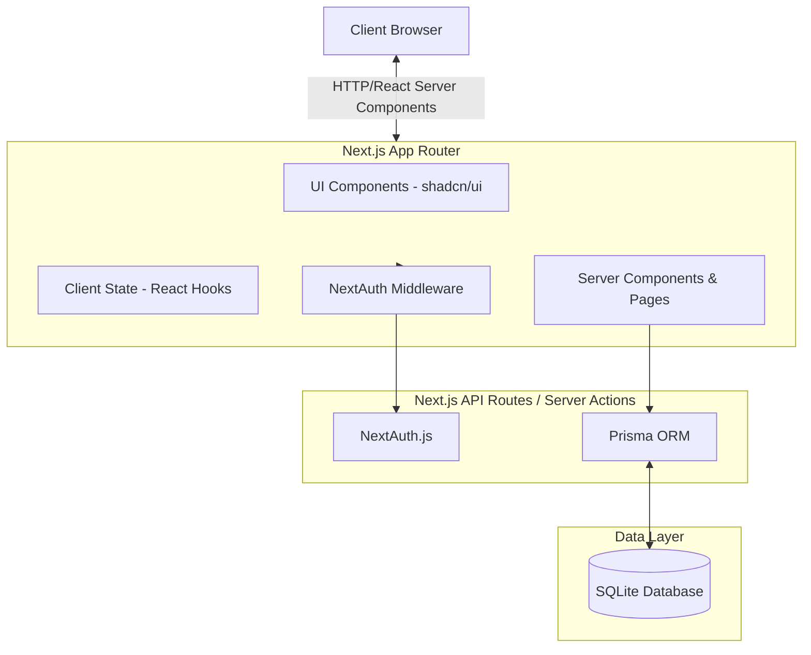

# AtomQuest Goal Setting & Tracking Portal

A robust, enterprise-grade Next.js application built for the AtomQuest Hackathon 1.0. This portal handles the entire lifecycle of goal setting, approvals, and tracking with role-based access control.

## 🏗️ Architecture



## ✨ Key Features
- **Role-Based Access**: Specialized interfaces for Employee, Manager, and Admin.
- **Goal Workflows**: Draft → Submit → Approve / Return cycle.
- **Admin Configuration**: Open/close cycle windows globally.
- **Modern UI**: Built with Tailwind CSS, shadcn/ui, and Radix primitives.

## 🚀 Setup & Local Development

1. **Install Dependencies**
   ```bash
   npm install
   ```

2. **Environment Configuration**
   Ensure `.env` exists in the root directory:
   ```env
   DATABASE_URL="file:./dev.db"
   NEXTAUTH_SECRET="my_super_secret_for_nextauth_in_this_hackathon"
   NEXTAUTH_URL="http://localhost:3000"
   ```

3. **Database Setup**
   Push the schema and seed the database with demo users:
   ```bash
   npx prisma db push
   npx prisma generate
   npx tsx prisma/seed.ts
   ```

4. **Run the Application**
   ```bash
   npm run dev
   ```

## 🔐 Demo Credentials
- **Admin**: `admin@demo.com`
- **Manager**: `manager@demo.com` 
- **Employee**: `employee@demo.com`
- *All passwords are*: `password`
